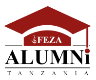
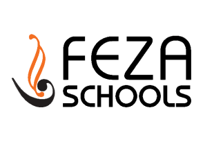
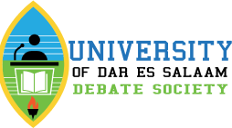
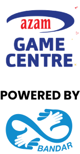

## Welcome 🥳
# TEDxUniversityOfDarEsSalaam Community

## About TED

> TED is a nonprofit organization devoted to Ideas Worth Spreading. Starting as a four-day conference in California 30 years ago, TED has grown to support its mission with multiple initiatives. The two annual TED Conferences invite the world's leading thinkers and doers to speak for 18 minutes or less. Many of these talks are then made available, free, at TED.com. TED speakers have included Bill Gates, Jane Goodall, Elizabeth Gilbert, Sir Richard Branson, Nandan Nilekani, Philippe Starck, Ngozi Okonjo-Iweala, Sal Khan, and Daniel Kahneman. [Know More!](https://www.ted.com/ "TED Official Website")  

## About TEDx

> In the spirit of ideas worth spreading, TEDx is a program of local, self-organized events that bring people together to share a TED-like experience. At a TEDx event, TED Talks videos and live speakers combine to spark deep discussion and connection. These local, self-organized events are branded TEDx, where x = independently organized TED event. The TED Conference provides general guidance for the TEDx program, but individual TEDx events are self-organized. (Subject to given rules and regulations. [Know More!](https://www.ted.com/ "TED Official Website")

## About Us

> **TEDxUniversityOfDarEsSalaam** is a locally and independently organized TEDx event, that is designed and organized by the students of University Of Dar es Salaam, with the aim of bringing to light narrations about what Tanzanians and the world is doing to drive development and change in Tanzania and the world in general to a global stage. It brings together a diverse and inclusive community that will take part in an amazing curated experience to discuss, listen, learn, network, be inspired, and aspire to be part of the change.Whilst following the rules and guidelines of the University Of Dar es salaam and TED .

## Our Mission

> To collect local and foreign thoughts , experiences ,  idealogies and stories from an interesting angle curate them and share them for the benefit of our current and future generations.

## Our Vision

> To be the leading event in curating the best  narratives that will impact African generations and echo through out the world.

## Event Organizers

Lead organizer: **Alex Mkwizu** 

> I have always believed to be a problem solver from a young age. Whilst in my secondary studies. I fell in love with the art of oration and its power to move souls, channel energy, and bring forth the desired impact. Exploring the field, I learned there is a huge gap for African narratives that have the power to shape generations to generations. I believe #tedxudsm is a step towards shaping African narratives, especially from Tanzania. 

Co-Lead Organizer: **Msafiri Ulimali**

> Stories make a difference. I have always believed in the power of stories, that they can change lives and even what people think. #tedxudsm has been a platform for them to tell their stories, be it about their personal lives, their careers, business or other creative issues. #tedxudsm2021 is just the beginning of bringing these stories to the hearts of Tanzanians.

## Join Us 🤝🏾

To be part of our Community Click [Here !](https://forms.gle/6rfSXGHwQnZCPVg26 "Event Community Application")

## 🤝🏾 Partners 🤝🏾

Beloved people and entities that workwith us hand in hand to curate the best TED experience for TEDxUniversityOfDarEsSalaam.
-  
---
| Partner's Logo | Partner's Website |
|:---:|---|
||<https://tassaa.org>|
| |<http://fezaalumni.org/>|
||<https://fezaschools.org/>|
||<https://www.instagram.com/udsmdebate/>|
||<https://www.bandarservice.com/>|
||_not-present_|

---
## Contact Us

| Media | Link |  
|---|---|
|**Email**✉️   :| <tedxdaressalaamuniversity@gmail.com>|
|**Twitter**🦜  : |<https://twitter.com/TEDxUdsm>|
|**Instagram**📸  : |<https://instagram.com/tedxudsm>|
|**LinkedIn**🔗  : |<https://www.linkedin.com/company/tedxuniversityofdaressalaam/>|
|**Flickr**🖼️  : | <https://www.flickr.com/photos/tedxuniversityofdaressalaam/>|
