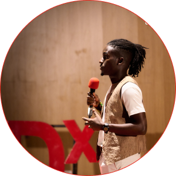

# TEDxUniversityOfDarEsSalaam

## TEDx Speakers 2021 🎙️🎤

| Speakers' Name | Speakers' Image | Speakers' Bio | Speakers' Video |  
|---|---|---|---|
|Jumanne Mtambalike| |Jumanne Mtambalike is the CEO Of SAHARA VENTURES, SAHARA SPARKS, and SAHARA ACCELARATOR an innovator, entrepreneur, and technology enthusiast who is optimistic about the future of Africa.| [21st Century Hunters and Gatherers](https://www.youtube.com/watch?v=JG92nafi2PY)
|Wilson Nkya||Wilson Nkya is an African inspired digital content creator with a background in film and Tv production. Wilson’s passion for entertainment and storytelling is driven by the beauty and authenticity of the African continent.|[Transforming passion into profession: Man in The Mirror](https://www.youtube.com/watch?v=Lt_VLrGN7DE)
|Vanessa Kissowile||Vanessa Is a founder of SHEFOUND, A Tanzanian born entrepreneur, business growth consultant and technology anthropologist in the tech-innovation space creating better opportunities for startups in emerging markets.| [Generational Investment For The Future Of Africa](https://www.youtube.com/watch?v=1Te0mMiEDDc)|
|John Alfred||John is a multifaceted professional in finance, project management, and business development. He has worked with renowned corporates, Non-Governmental Organisations, and startups in moving their operations.|[The Next Economic-Brigade:Potential Of Financial Markets](https://www.youtube.com/watch?v=vE1OOBNfzE4)|
|Baraka Mafole||My name is Baraka Israel Mafole, I'm a Co-Founder of Sanuka Kidijitali (an Initiative that aimed to empower Tanzania Youth with digital skills so that they can be competitive in the digital economy.|[Gig Economy And The Future Of Employment](https://www.youtube.com/watch?v=KhV2ziJxME8)|
|Mercy Masanga||Mercy Masanga is the current chairperson of the student government organization at the College of Engineering and Technology (COET) in the University of Dar es salaam. She is also a poet and an author.|[Finding My Voice An Escape Through Poetry](https://www.youtube.com/watch?v=0_RgCzhi8rY)|
|Robert Sadowski||Robert is a Polish businessman, philanthropist, and CEO of Sawa Logistics. He is an expert in emergency shipping. His passion is not contained only within logistics. It spills over into philanthropy and personal endeavors.|[My Little Fight For Closing The Gap](https://www.youtube.com/watch?v=7UxcOUdkI7I)|
|Elijah David||Elijah David a talented architect student and musician , He elevates the frequency of human love, being together, feeling empathy for each other as a way to survive through troubling times, and celebrating during good times via his graceful voice connecting humans together, eliminating the gap.|[Let's Come Together:Tuje Pamoja](https://www.youtube.com/watch?v=mrpigagjGtM)|
