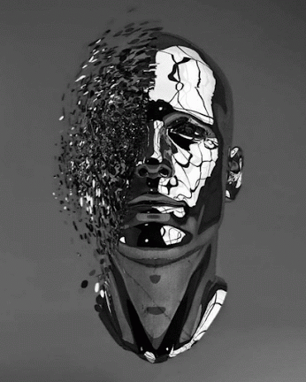
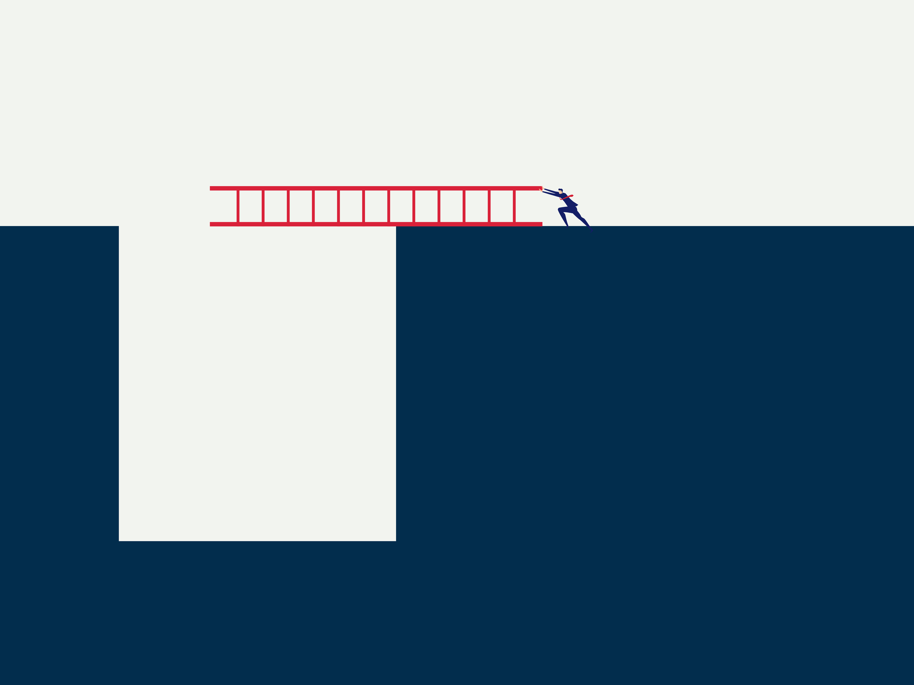
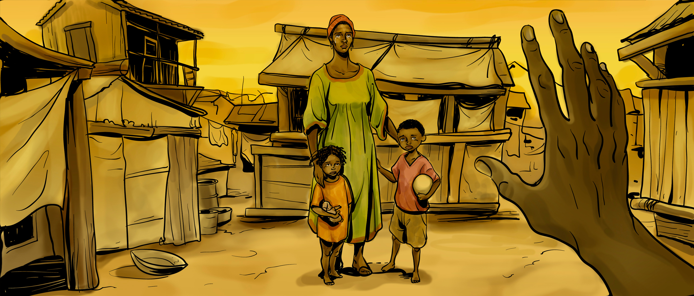

# TEDxUniversityOfDarEsSalaam 

## Theme 2021 🎨 🖌️ : CLOSING THE GAP  🤝🏾

## Visual Design Concept

|🎨|🎨|🎨|
|---|---|---|
||||

> Visualization of objects coming together, differences and problems that exist in our communities. People coming together to address differences and problems in our society.

## About The Theme

> As the world is rapidly changing, Tanzania is changing with it. These changes occurring all over the world give birth to different gaps in different sectors and they affect our communities in various ways. Gaps can be in different kinds in our communities, for instance, educational gap, employment gap, technology gap, talent gap, economic gap, gender gap, knowledge gap, health gap, development gap, and many more.
>
>It is with a keen eye; we have spotted a group of people who have taken the initiative to address these gaps.  Yet most of these individuals don't get a chance to share their experiences, ideas, and perspectives that have positively impacted Tanzania and the world taking initiatives.
>
>Our vision in this year's event is that addressing these gaps will bring the gaps and those who took initiatives to address them into the spotlight to raise awareness, aspire and inspire communities to join forces to address the gaps to create a better resilient and sustainable community for today and tomorrow.
>
>By doing so our communities will know why as a member of a particular community it’s necessary to address problems found in your locality, but also understand why others are doing it or how others are doing it. The event gives a chance for people to spark discussions that matter and interconnect with people from different backgrounds and perspectives to allow inclusion and diversity of the audience and its ideas.

## African Context

> "Closing the Gap" is a theme that refers to the efforts to bridge the disparities and inequalities between different groups within a society, particularly in terms of access to resources, opportunities, and services.
>
> In the African context, this theme is often used in the context of development and addressing the challenges facing the continent, such as poverty, lack of access to education and healthcare, and economic disparities.
>
> This theme is refers to the need to close the gap between Africa and the rest of the world in terms of economic development, political stability, and social progress. The goal of "Closing the Gap" is to improve the lives of people in Africa and to promote sustainable development on the continent.