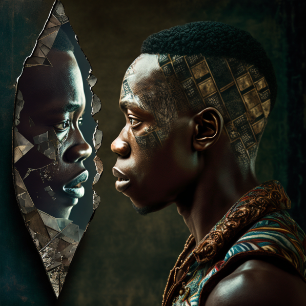
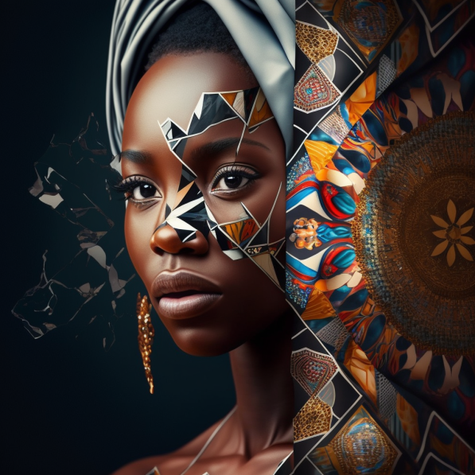
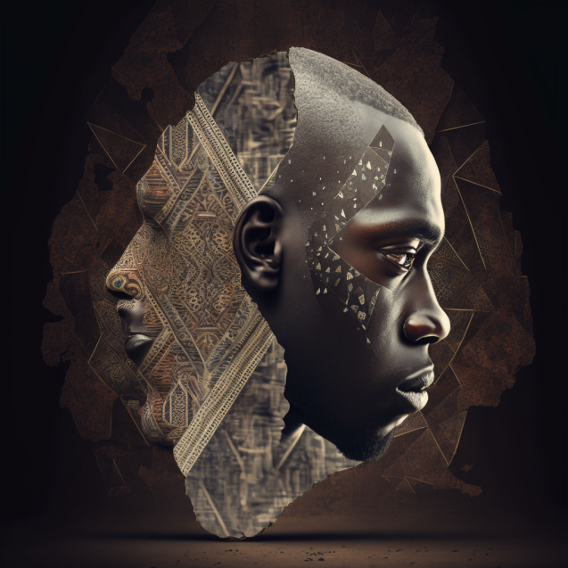

# TEDxUniversityOfDarEsSalaam 

|🖼️|🖼️|
|---|---|
|||

_These images are AI generated , and they are under CC License: Creative Commons License_

## Theme 2023 🎨 🖌️ : MOMENT OF REFLECTION 🪞 ⌛

### Visual Design Concept  

|🖼️|🖼️|🖼️|
|---|---|---|
|||
> Time Instruments, Mirrors, Reflections, Broken Pieces, Shiny Surfaces, Reflections, Connection concepts of the past, present, and the future, Aesthetic value of African contextual environment.

  

### Sustainable Development Goals

| SDG 9 | SDG 11 | SDG 17 |
|---|---|---|
||||

>- [x] SDG 9 | Industry, Innovation and Infrastructure
>- [x] SDG 11 | Sustainable Cities and Communities  
>- [x] SDG 17 | Partnership for the Goals

>The theme touches mainly on the above three SDGs since our speakers and theme is targeted to the sect of community that is building now, for tomorrow, to ensure sustainable living in our communities and drive action by partnering with other SDGs champions i.e, institutions.

  

## About the Theme. [ Past⬅️, Present⬇️, Future➡️ ]

> The theme chosen is an effort to address a core issue of understanding where we came from, where we are and where we are heading. We believe answering these three fundamental questions is essential for any community to have a clear purpose and vision to shape their progress and development in the best way possible.

> The theme challenges us to seek the deep roots of our communities, the current status as a result of decisions made by the past generations, and what decisions should we make to ensure a sustainable future, for now, and for the coming generations.

> It explores different fields like innovation, agriculture, finance, etc., and how truly can they be used to embrace the present, and prepare for the future by understanding the past.

## African Context 🥁

> In many African cultures, the concept of reflection and introspection is deeply ingrained and valued. Reflection is often seen as a way to gain insight, wisdom, and understanding, and it is often associated with spiritual growth and personal development.  

> In African culture, reflection is often linked to the idea of **"Ubuntu,"** which is a Bantu term that refers to the interconnectedness of all human beings and the idea that we are all part of a larger community. Ubuntu emphasizes the importance of compassion, empathy, and caring for others, and it is often seen as an important aspect of African philosophy and worldview.   

> Reflection is also often seen as a way to connect with one's ancestors and the spiritual world. Many African cultures place great importance on the idea of ancestor reverence, and reflection is seen as a way to honour and connect with one's ancestors and the spirit world.   

> Overall, the theme of reflection in African culture is closely tied to the values of compassion, empathy, spiritual growth, and connection to others and the spiritual world. It is an important aspect of African culture that helps individuals to gain insight, wisdom, and understanding and live a more fulfilling and meaningful life. 

